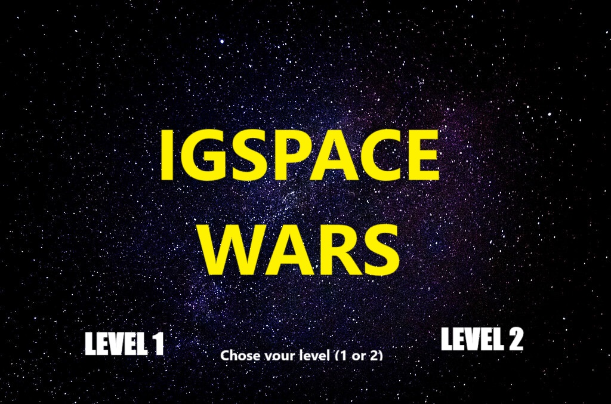

# 🚀 Object Oriented Programming Game (C++)

### IGSPACE WARS

[](https://youtu.be/odfq9dw64tE)
[](https://isocpp.org/)
[](https://www.sfml-dev.org/)

A 2D top-down space shooter built from scratch in **C++17** with **SFML**, made as an object-oriented programming project. Pick your level, dodge and destroy waves of enemy ships, keep your health bar up, and rack up the highest score you can before your ship goes down.



## Demo

▶️ **[Watch on YouTube](https://youtu.be/odfq9dw64tE)** — menu, level select, both levels, combat and game over screen.

---

## Gameplay

| Screen | Description |
|---|---|
| **Menu** | Choose **Level 1** or **Level 2** with the keyboard |
| **Level 1** | Single wave type — `EnemyShip` enemies spawn and fire straight down at the player |
| **Level 2** | Adds `EnemyShip2`, a tougher enemy (3 hits to destroy) that fires a second bullet pattern, including a reversed variant |
| **Game Over** | Shown when the player ship is destroyed; press **Enter** to return to the menu |

### Controls

| Key | Action |
|---|---|
| `1` / `2` | Select Level 1 / Level 2 from the menu |
| `↑ ↓ ← →` | Move the player ship |
| `Space` | Fire |
| `Enter` | Restart from the Game Over screen |

## How it works

The game runs on a single `sf::RenderWindow` game loop (`Game::run`) driven by a state machine:

```
Menu → Level1 / Level2 → (combat loop) → GameOver → Menu
```

Each frame: `handleEvents()` reads input, `update(dt)` advances ships/bullets and spawns enemies on independent clocks, `handleCollisions()` resolves hits, and `render()` draws the current frame.

## Object-oriented design

The project leans on inheritance and polymorphism to share ship/bullet behaviour while letting each type override its own movement, shooting pattern, and collision response.

```
Ship (abstract base: position, sprite, collidesWith*)
├── PlayerShip   — movement, shooting, health bar, damage handling
├── EnemyShip    — straight-down movement, single bullet pattern
└── EnemyShip2   — tougher (3-hit), dual bullet pattern (EnemyBullet2 / EnemyBullet2Reverse)
```

| Class | Responsibility |
|---|---|
| `Game` | Window, game loop, state machine, spawning, collisions |
| `Ship` | Shared base for all ships — position, sprite, collision checks |
| `PlayerShip` | Player movement, shooting, health/damage, health bar |
| `EnemyShip` / `EnemyShip2` | Enemy movement, shoot timers, hit points |
| `Bullet` / `EnemyBullet` / `EnemyBullet2` / `EnemyBullet2Reverse` | Projectile movement, bounds, off-screen cleanup |
| `Healthbar` | Player HP bar rendering |
| `FloatingText` | Damage/score pop-up text |

## Assets

All game art, backgrounds and the custom font live in [`assets/`](assets):

| File | Use |
|---|---|
| `skybackgroundmenu.jpg` | Main menu background |
| `skybackground.jpg` / `skybackgroundreverse.jpg` | Level 1 / Level 2 scrolling backgrounds |
| `gameover.jpg` | Game over screen background |
| `premiumspaceship.png` | Player ship sprite |
| `enemy.png` / `enemyship2.png` | Enemy ship sprites (Level 1 / Level 2) |
| `Space Story.otf` | UI / HUD font |

## Build

Built with **Qt Creator** using a plain `qmake` project (no Qt framework dependency — pure C++/SFML).

1. Install [SFML 2.5.1](https://www.sfml-dev.org/download/sfml/2.5.1/) and update the `INCLUDEPATH` / `LIBS` paths in [`gametry.pro`](gametry.pro) to match your local SFML install.
2. Open `gametry.pro` in Qt Creator (or run `qmake && make` from the command line).
3. Build and run — the executable expects the `assets/` folder to sit alongside it at runtime.

## Repository structure

```
.
├── assets/            # backgrounds, sprites, font
├── Game.h/.cpp         # game loop, state machine, spawning, collisions
├── Ship.h/.cpp         # base ship class
├── PlayerShip.h/.cpp   # player ship
├── EnemyShip.h/.cpp    # Level 1 enemy
├── EnemyShip2.h/.cpp   # Level 2 enemy
├── Bullet.h/.cpp, EnemyBullet*.h/.cpp   # projectiles
├── Healthbar.h/.cpp    # HP bar UI
├── FloatingText.h/.cpp # floating damage/score text
├── main.cpp
└── gametry.pro          # qmake project file
```

## Author

**Oskar Jabłonowski**

## License

[MIT](LICENSE)
